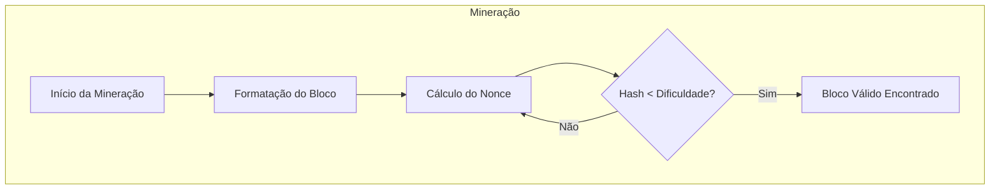
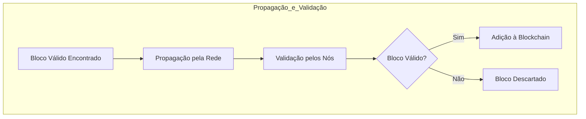
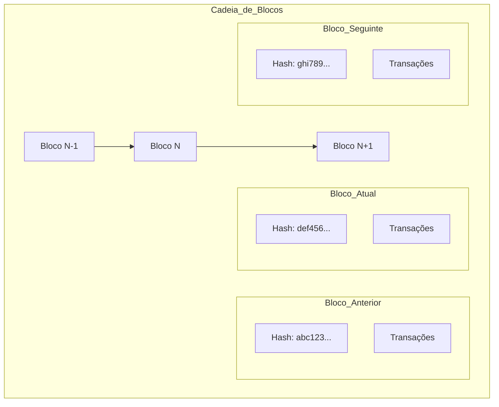
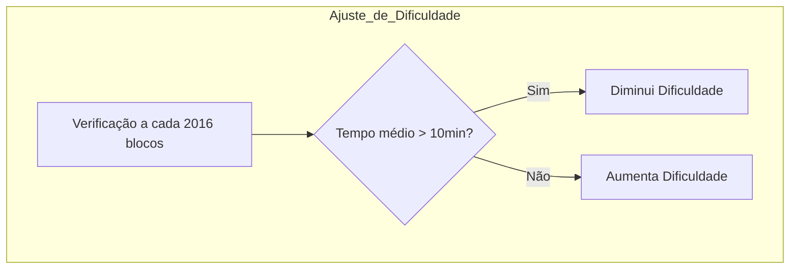
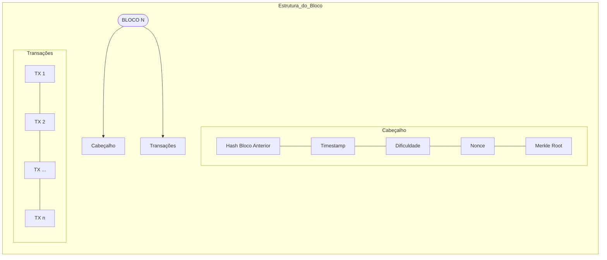

---
tags:
  - blockchain
  - criptografia
---
# Blockchain: O Livro Razão do Bitcoin
Uma blockchain (corrente de blocos) é um **banco de dados distribuído** que armazena
informações de maneira segura e transparente, funcionando como um *livro-razão* digital onde os dados são organizados em **blocos interligados criptograficamente**.  Mais pra frente exploraremos como tudo isso ocorre!

Cada bloco contém um registro de transações, um carimbo de data/hora e uma referência ao bloco anterior, garantindo a imutabilidade dos dados, pois qualquer alteração em um bloco afetaria toda a cadeia.

### Prova de Trabalho (Proof of Work—PoW)
O Bitcoin utiliza um mecanismo de consenso chamado **Prova de Trabalho**, que requer que os mineradores resolvam um **problema matemático computacionalmente difícil** para adicionar um novo bloco à blockchain. ==O primeiro minerador a resolver o problema ganha o direito de adicionar o bloco e receber a recompensa do bloco em bitcoin==, juntamente com as taxas de transação dos Bitcoins transferidos no bloco.
- **A cadeia com mais poder de hash acumulada:** A regra geral para a aceitação de uma cadeia de blocos é que os nós sempre consideram a cadeia de maior ==dificuldade cumulativa ou onde mais recursos computacionais foram gastos como a cadeia válida==. Isso garante que a maioria do poder de processamento da rede concorda com o histórico de transações.
### Regras de formatação de transação
As transações devem seguir um formato específico e incluir uma assinatura digital válida para serem consideradas válidas. Elas devem também se referir a saídas de transações anteriores não gastas (UTXOs—Unspent Transaction Outputs).
# Emissão de novos bitcoin
A recompensa por bloco para os mineradores é reduzida pela metade a cada 210.000 blocos (aproximadamente a cada quatro anos) em um evento conhecido como **"halving"**. Isso **controla a emissão** de novos bitcoins e é uma regra fundamental para a política monetária predefinida do Bitcoin. Essa política monetária também inclui um ==limite máximo de 21 milhões de bitcoins que poderão ser emitidos.== 

Esse teto absoluto garante que o Bitcoin seja uma **moeda deflacionária**, protegendo-a contra a inflação excessiva.

### Transações de tempo de bloqueio (timelock)
Algumas transações incluem uma **regra** de tempo que impede que sejam adicionadas a um
bloco até que um certo número de blocos ou um período de tempo tenha passado.
Essas regras são implementadas e aplicadas por meio do software que os participantes da
rede (nós e mineradores) executam.

### Validação de blocos
Antes de um bloco ser adicionado à blockchain, ele deve ser validado pelos nós, garantindo
que todas as transações dentro dele são válidas.

### Reorganização de blocos
Se dois blocos são encontrados quase simultaneamente, a rede eventualmente seguirá a
cadeia que se torna mais longa primeiro, descartando o bloco órfão.

### Ajuste de dificuldade
Como a mineração é um processo probabilístico, de tentativa e erro, a velocidade de saída dos blocos é diretamente proporcional à quantidade de máquinas mineradoras participando do sistema (hash power) em determinado período. Para que o tempo de saída dos blocos seja mantido estável, a dificuldade do problema matemático ajusta-se aproximadamente a cada duas semanas (ou a cada 2016 blocos) para garantir que novos blocos sejam adicionados aproximadamente a cada 10 minutos.

### Regras de formatação de blocos
Blocos devem ter uma estrutura específica, incluindo um cabeçalho de bloco que contém o
hash do bloco anterior, o timestamp, a dificuldade alvo e o nonce. O nonce é um número
aleatório usado uma única vez para gerar variações no resumo de hash de um bloco. Os
mineradores ajustam o nonce repetidamente até encontrar um valor de hash que esteja abaixo do valor-alvo definido pelo nível de dificuldade da rede. Essa operação é parte essencial do mecanismo de Prova de Trabalho (Proof of Work) no processo de mineração do Bitcoin.

### Propagação de blocos
Após um minerador encontrar um bloco válido, ele deve propagá-lo rapidamente pela rede para que outros nós possam validá-lo e começar a trabalhar no próximo bloco.

---
# Para saber mais
https://bitcoindevs.xyz/decoding
https://medium.com/@carneiroandre/explincando-blockchain-e6883637cde2

---
# Fonte
[Scalar School - Bitcoin Tecnology Foundations and Career Paths](https://drive.google.com/drive/folders/1KJjZaftdF9XQZC2xA0aHavinoa3kJmjx)
