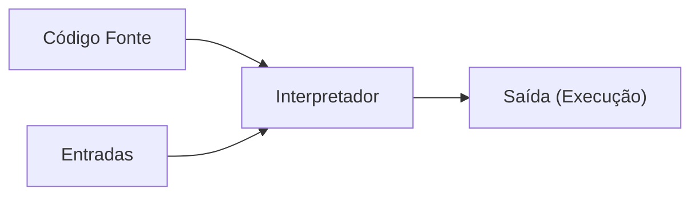
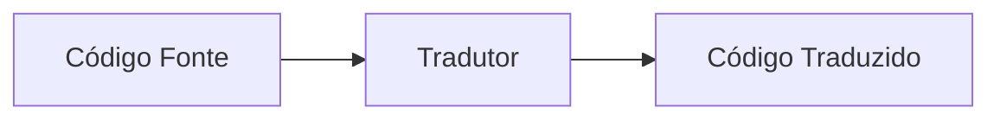
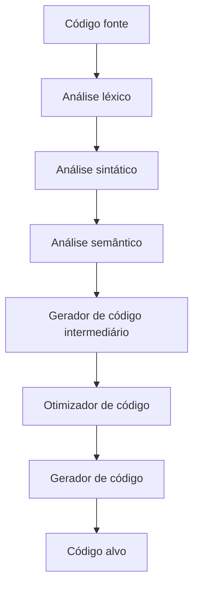

---
tags:
  - ciencia-da-computação
  - compiladores
---
O estudo da compilação e interpretação das linguagens de programação envolve a tradução de código-fonte de alto nível para código compreensível por computadores (binário).
### Processo de Tradução
Os computadores entendem apenas código binário (0s e 1s). Para executar programas escritos em linguagens de alto nível, é necessário traduzi-los. Isso pode ser feito por um **compilador** ou um **interpretador**.

#### Compilador
- Traduz o código inteiro antes da execução, gerando um arquivo executável.
- Exemplo: Linguagens como **Java** e **C** utilizam compilação.

**Fluxo de compilação:**



**Exemplo em C:**

```c
#include <stdio.h>
int main() {
    printf("Olá, mundo!\n");
    return 0;
}
```

_Compilação:_ `gcc programa.c -o programa` _Execução:_ `./programa`

#### Interpretador

- Traduz e executa o código linha por linha.
- Exemplo: Linguagens como **Python** e **Ruby** utilizam interpretação.

**Fluxo de interpretação:**



**Exemplo em Python:**

```python
print("Olá, mundo!")
```

_Execução direta:_ `python programa.py`

### Vantagens e Desvantagens

|Método|Vantagens|Desvantagens|
|---|---|---|
|Compilação|Execução rápida, otimização de código|Processo de compilação lento e complexo|
|Interpretação|Facilidade para testes e depuração|Execução mais lenta, precisa do interpretador|

## Processo de Compilação

A compilação ocorre em duas etapas principais:

1. **Análise**: Verifica se o código-fonte está correto.
    - **Análise Léxica**: Identifica tokens (exemplo: palavras-chave como `if`, `while`).
    - **Análise Sintática**: Verifica a estrutura do código.
    - **Análise Semântica**: Confere coerência do código.
2. **Síntese**: Gera o código executável.
    - **Geração de Código Intermediário**
    - **Otimização de Código**
    - **Geração de Código Final**

**Fluxo do compilador:**



### Exemplo de Análise Léxica

Código-fonte em C:

```c
int x = 10;
```

Tokens identificados:

```plaintext
[int] [x] [=] [10] [;]
```

Compreender esse processo é fundamental para entender como linguagens de programação são processadas pelos computadores.
### Tokens e Análise Léxica
Tokens são os menores elementos sintáticos de um código-fonte, classificados como:

- **Tokens simples**: palavras reservadas, operadores e delimitadores (ex.: `<if>`, `<+>`).
- **Tokens com argumento**: identificadores e constantes numéricas (ex.: `<id, soma>`, `<número, 10>`).

Ferramentas como **Lex** e sua versão em Java, **JFLEX**, são utilizadas para implementar analisadores léxicos. O JFLEX processa um arquivo contendo expressões regulares e gera código Java capaz de identificar tokens no código-fonte.

### Análise Sintática
A análise sintática verifica se as instruções seguem a estrutura correta da linguagem. Por exemplo:

- `int total = 12;` → estrutura válida.
- `total int 12 =;` → erro sintático devido à ordem incorreta dos elementos.

O analisador sintático representa as instruções por meio de árvores sintáticas. Ferramentas como **YACC** auxiliam na implementação dessa análise, permitindo a verificação de gramáticas formais.

### Análise Semântica
A análise semântica verifica se as instruções fazem sentido dentro do contexto do programa. Exemplo de erro semântico:

- `int y = "nome";` → um inteiro não pode receber uma string. Essa análise depende das regras da linguagem e pode variar conforme o ambiente de programação.

### Geração e Otimização de Código
Após a análise, o código é transformado em um formato executável, passando por três etapas:

1. **Geração de código intermediário**: facilita otimizações e a adaptação a diferentes arquiteturas.
2. **Otimização**: melhora a eficiência e reduz redundâncias, como eliminar variáveis não utilizadas.
3. **Geração de código final**: converte o código otimizado para linguagem de máquina.

A otimização melhora a velocidade e o tamanho do programa, garantindo um melhor uso dos recursos computacionais.

![[Pasted image 20250304203909.png]]

---
# Fontes
#### Livros
*Construindo Compiladores*
KEITH D. C.; TOREZON, L. Construindo Compiladores. 2ª Edição. Editora
Campus, Elsevier.
#### Leitura
*Basics of Compiler Design*
MOGENSEN, T. A. Basics of Compiler Design, 2010.
http://bit.ly/2LorUn2
*Lexical Analysis and Parsing using C*
PREISS, B., Lexical Analysis and Parsing using C, 2004.
http://bit.ly/2oN4MXI
*Compiler Construction*
WAITE, W. M.; GOOS, G., Compiler Construction, 1996.
http://bit.ly/2LoT2Cu